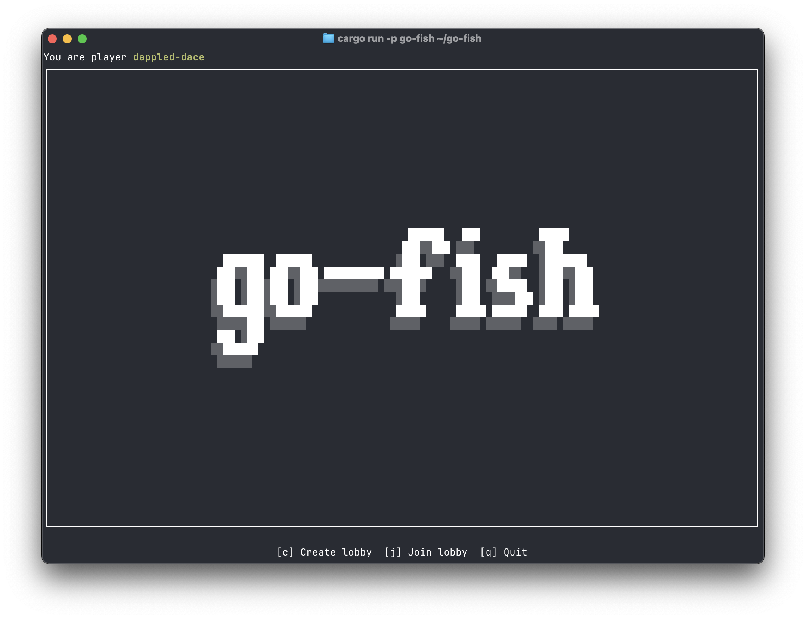
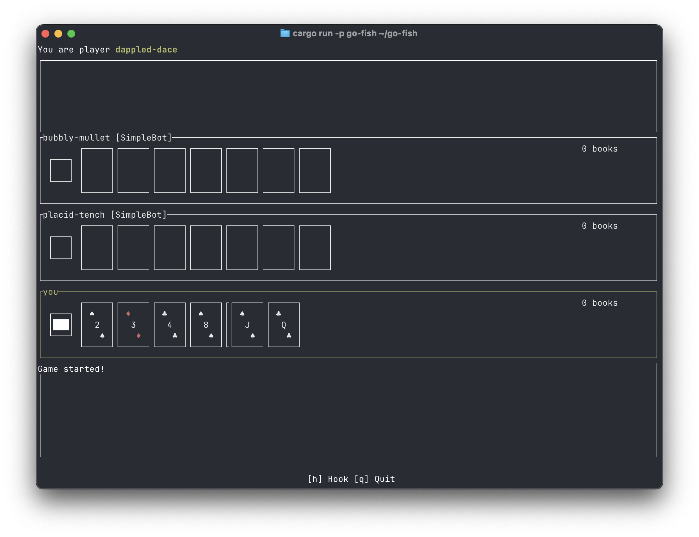

A terminal-based implementation of the card game Go Fish, written in Rust with a WebSocket backend. 
The game state lives server-side; a TUI client written in [Ratatui](https://github.com/ratatui/ratatui) 
can be used either in your terminal or in the browser as a WASM target.

Live at [terminaltom.com/go-fish](https://terminaltom.com/go-fish).

